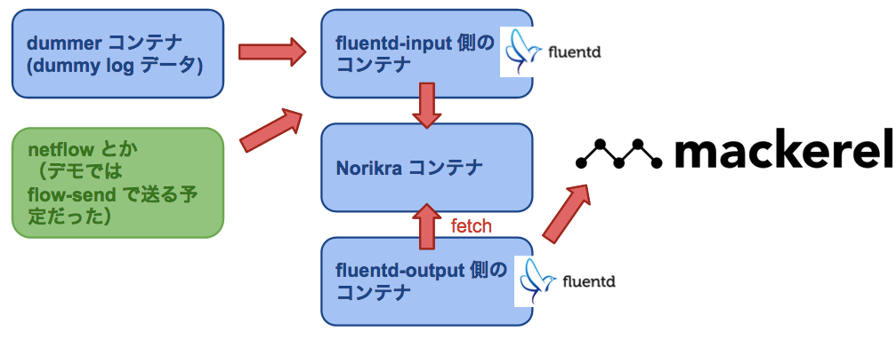

# [Norikra](http://norikra.toraja.klab.org/) のデモ（社内勉強用）

これ使って出来上がるもの

- dummy のログを Norikra に投げて、Norikra で SQL 書くと Mackerel にグラフを生成する環境を構築できる



dummer コンテナは dummy log を生成するため。本番などではアクセスログを in_tail で引っ張ってくるなど

## 参考にさせていただいた資料/サイト

[メルカリでのNorikraの活用、 Mackerelを添えて](http://www.slideshare.net/kazeburo/norikra-mackerel)
[Norikraでそこそこ手軽にNetFlow解析 - yunazuno.log](http://yunazuno.hatenablog.com/entry/2015/03/31/135712)

## 必要なもの

- [docker](https://github.com/docker/docker)
- [docker-compose](https://github.com/docker/compose)

## セットアップ方法

### レポジトリを clone

```console
$ git clone https://github.com/yokogawa-k/docker-norikra_demo.git
```

### Mackerel の設定

Mackerel に **norikra_demo** というサービスを作り、レポジトリに mackerel.env ファイルを用意し API_KEY を登録する。

```console
$ cat mackerel.env
MACKEREL_API_KEY=xxxx
```

"" などで囲んだら多分ダメ

## 使い方

1. `docker-compose up` でコンテナを生成する
2. ホストマシンのポート 26578 にアクセスして Norikra をいじくる。
  - Norikra での qeury_group は `metrics` とすると Mackerel に投げるようになります
  - percentile の UDF を利用する場合は qeury_group を `metrics_percentiles` とすること
3. Mackerel にログがはかれているてることを確認する (ﾟдﾟ)ｳﾏｰ

## 注意事項

- ログは [sonots/dummer](https://github.com/sonots/dummer) で生成したニセのログです。
- Norikra のクエリーグループを metrics|metrics_percentiles としたもののみ Mackerel に送られます。
- metrics_percentiles は Norikra で udf-percentile の percentiles() を使った場合に有効
